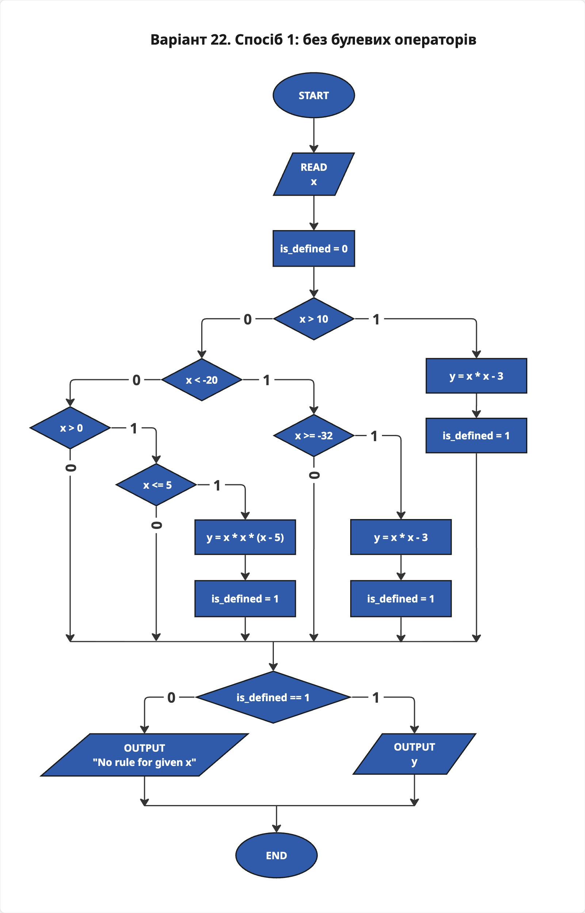
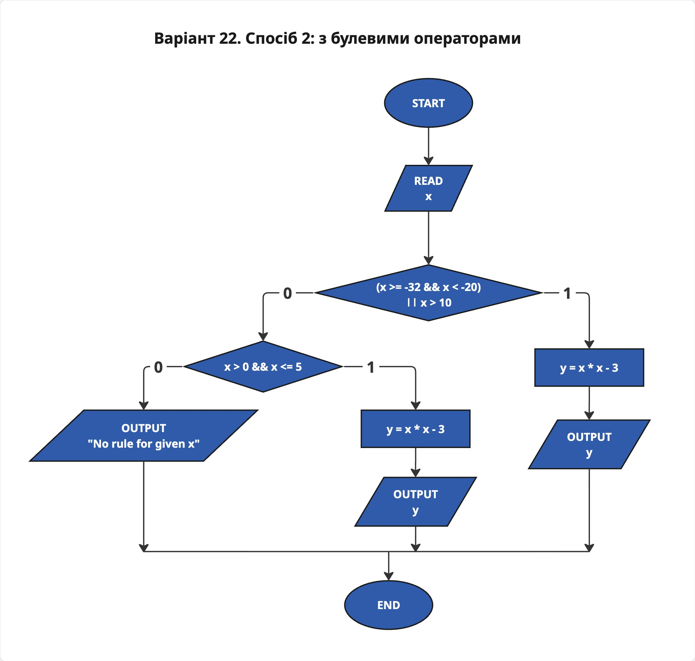
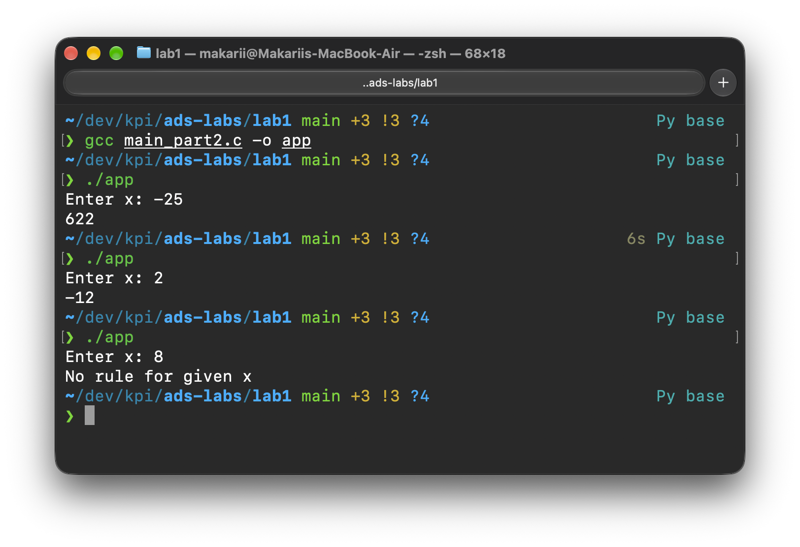

# Лабораторна робота №1
## Тема: Розгалужені алгоритми

- **Дисципліна:** Структури даних та алгоритми
- **Виконав:** студент групи ІО-63 Слупський Макарій
- **Варіант:** 22
 
---

## 1. Завдання та варіант

Для заданого дійсного $x$ обчислити значення кусково-неперервної функції $y(x)$, якщо воно існує, або вивести повідомлення про неіснування функції.

**Варіант 22:**
- $f_1(x) = x^3 - 5x^2, \quad x \in (0, 5]$
- $f_2(x) = x^2 - 3, \quad x \in [-32, -20) \cup (10, +\infty)$
- Для $x \notin D_1 \cup D_2$ функція не визначена.

Задачу розв'язано двома способами:
1. Тільки одиничні операції порівняння, без булевих операторів (`&&`, `||`, `!`).
2. Із використанням булевих логічних операцій.

---

## 2. Блок-схеми алгоритмів

### 2.1. Спосіб 1: Без булевих операторів


### 2.2. Спосіб 2: З булевими операторами


---

## 3. Вихідний код програм

### 3.1. Спосіб 1 (без булевих операцій)
Файл: [`main_part1.c`](./main_part1.c)

```c
#include <stdio.h>

int main() {
  double x, y;
  int is_defined;

  printf("Enter x: ");
  scanf("%lf", &x);

  is_defined = 0;
  
  if (x > 10) {
    y = x * x - 3;
    is_defined = 1;
  } else {
    if (x < -20) {
      if (x >= -32) {
        y = x * x -3;
        is_defined = 1;
      }
    } else {
      if (x > 0) {
        if (x <= 5) {
          y = x * x * (x - 5);
          is_defined = 1;
        }
      }
    }
  } 

  if (is_defined == 1) {
    printf("%g\n", y);
  } else {
    printf("No rule for given x\n");
  }

  return 0;
}
```

### 3.2. Спосіб 2 (з булевими операціями)
Файл: [`main_part2.c`](./main_part2.c)

```c
#include <stdio.h>

int main() {
  double x, y;

  printf("Enter x: ");
  scanf("%lf", &x);
  
  if ((x >= -32 && x < -20) || x > 10) {
    y = x * x - 3;
    printf("%g\n", y);
  } else {
    if (x > 0 && x <= 5) {
      y = x * x * (x - 5);
      printf("%g\n", y);
    } else {
      printf("No rule for given x\n");
    } 
  }
  
  return 0;
}
```

---

## 4. Результати тестування програм

Тестовий набір даних покриває всі можливі гілки виконання:
1. $x = 2$ — потрапляє в $D_1$
2. $x = -25$ — потрапляє в $D_2$
3. $x = 12$ — потрапляє в $D_2$
4. $x = -50$ — значення поза областю визначення ($x < -32$)
5. $x = -10$ — значення в проміжку між $[-20, 0]$
6. $x = 8$ — значення в проміжку між $[5, 10]$

| Вхідне $x$ | Очікуваний результат | Результат програми 1 | Результат програми 2 | Статус |
|:---:|:---:|:---:|:---:|:---:|
| `2` | $y = -12$ | $y = -12$ | $y = -12$ | Пройдено |
| `-25` | $y = 622$ | $y = 622$ | $y = 622$ | Пройдено |
| `12` | $y = 141$ | $y = 141$ | $y = 141$ | Пройдено |
| `-50` | No rule for given x | No rule for given x | No rule for given x | Пройдено |
| `-10` | No rule for given x | No rule for given x | No rule for given x | Пройдено |
| `8` | No rule for given x | No rule for given x | No rule for given x | Пройдено |

### Скріншоти виконання:

#### Спосіб 1:


#### Спосіб 2:


---

## 5. Висновок

У ході виконання лабораторної роботи було опановано використання керуючих конструкцій розгалуження в мові програмування C. Реалізовано обчислення кусково-неперервної функції двома способами: за допомогою вкладених умовних операторів (без логічних зв'язок) та за допомогою складених логічних виразів (`&&`, `||`). Обидві програми протестовано на граничних та внутрішніх точках тестового набору, результати роботи програм ідентичні та відповідають побудованим блок-схемам алгоритмів.