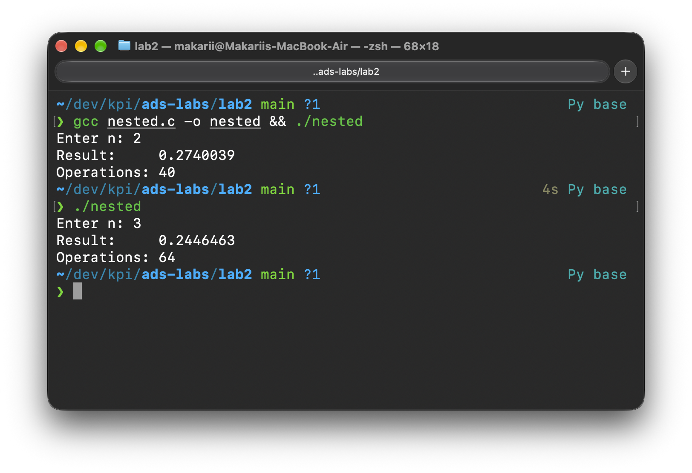
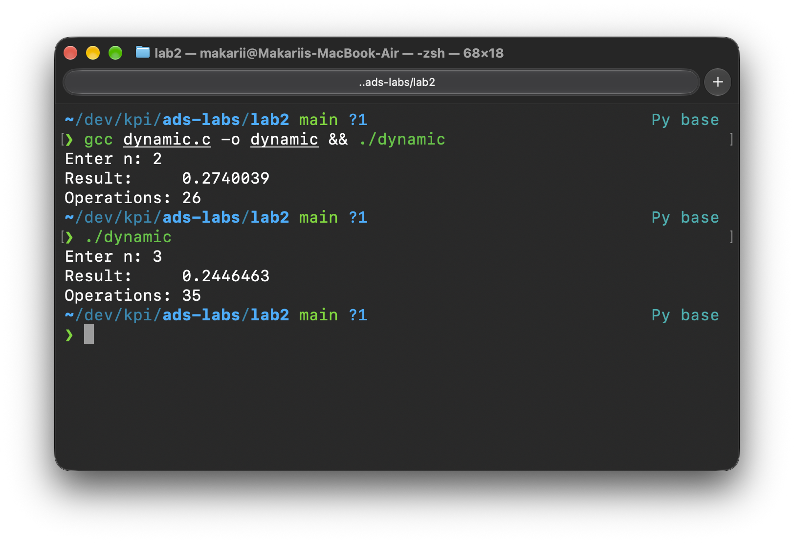
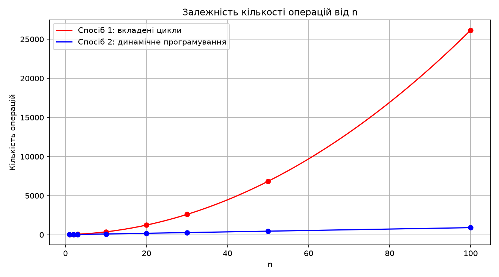
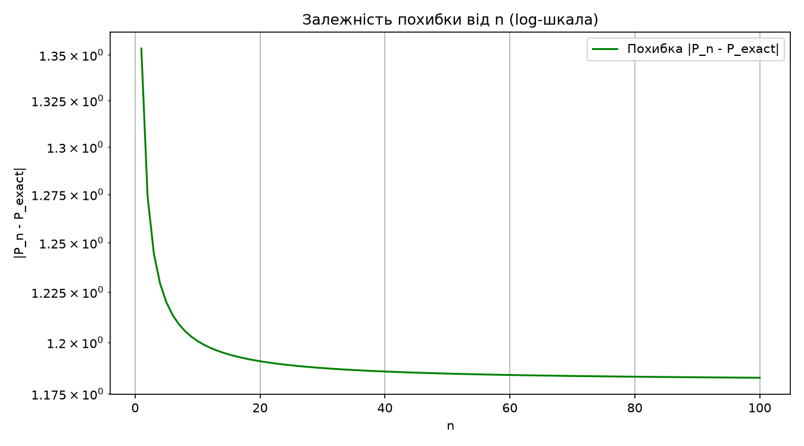

# Лабораторна робота №2
## Тема: Алгоритми з вкладеними циклами та метод динамічного програмування

- **Дисципліна:** Структури даних та алгоритми
- **Виконав:** студент групи ІО-63 Слупський Макарій
- **Варіант:** 22

---

## 1. Завдання та варіант

Задане натуральне число n. Обчислити значення заданої формули двома способами:
1. За допомогою **вкладених циклів**.
2. За допомогою **одного циклу** з використанням **методу динамічного програмування**.

**Варіант 22:**

```
P = cos(πx/4) − sin(πx/4) = √2 · Π(i=1..n){ 1 − (1+x)² / [4·Σ(j=1..i)(4j−1)] },  x = 2
```

Точне значення при x = 2: `cos(π/2) − sin(π/2) = 0 − 1 = −1`

---

## 2. Аналіз формули

Нехай $S_i = \sum_{j=1}^{i}(4j-1)$. Перші значення:
- $S_1 = 3$, $S_2 = 10$, $S_3 = 21$
- Загальна формула: $S_i = 2i^2 + i$

Числівник $(1+x)^2 = 9$ — фіксований, обчислюється один раз до циклу.

**Ідея ДП:** замість обчислення $S_i$ у внутрішньому циклі — накопичуємо: $S_i = S_{i-1} + (4i-1)$.

---

## 3. Вихідний код програм

### 3.1. Спосіб 1 — вкладені цикли
Файл: [`nested.c`](./nested.c)

```c
#include <stdio.h>

#define SQRT_2 1.4142135623730951

int main() {
    int n;
    printf("Enter n: ");
    scanf("%d", &n);

    double x = 2.0;
    double res = SQRT_2;
    double s;
    double num = (1.0 + x) * (1.0 + x); // precompute (1+x)^2

    unsigned long long ops = 0;
    ops += 6; // init: x, res, num (add+mul+assign), ops

    for (int i = 1; i <= n; ++i) {
        ops += 1; // i <= n
        s = 0.0;
        ops += 1; // s = 0
        ops += 1; // j = 1

        for (int j = 1; j <= i; ++j) {
            ops += 1; // j <= i
            s += 4.0 * j - 1.0;
            ops += 3; // mul, sub, +=
            ops += 1; // ++j
        }
        ops += 1; // final j <= i

        res *= 1.0 - num / (4.0 * s);
        ops += 4; // 4*s, /, 1-, *=
        ops += 1; // ++i
    }
    ops += 1; // final i <= n

    printf("Result:     %.7f\n", res);
    printf("Operations: %llu\n", ops);

    return 0;
}
```

### 3.2. Спосіб 2 — динамічне програмування
Файл: [`dynamic.c`](./dynamic.c)

```c
#include <stdio.h>

#define SQRT_2 1.4142135623730951

int main() {
    int n;
    printf("Enter n: ");
    scanf("%d", &n);

    double x = 2.0;
    double res = SQRT_2;
    double s = 0.0;
    double num = (1.0 + x) * (1.0 + x); // precompute (1+x)^2

    unsigned long long ops = 0;
    ops += 7; // init: x, res, s, num (add+mul+assign), ops

    for (int i = 1; i <= n; ++i) {
        ops += 1; // i <= n
        s += 4.0 * i - 1.0;
        ops += 3; // mul, sub, +=
        res *= 1.0 - num / (4.0 * s);
        ops += 4; // 4*s, /, 1-, *=
        ops += 1; // ++i
    }
    ops += 1; // final i <= n

    printf("Result:     %.7f\n", res);
    printf("Operations: %llu\n", ops);

    return 0;
}
```

---

## 4. Підрахунок кількості операцій

**Спосіб 1.** На кожній ітерації зовнішнього циклу `i` виконується `9 + 5i` операцій (з урахуванням внутрішнього циклу). Загалом:

```
T₁(n) = 6 + Σ(i=1..n)(9 + 5i) + 1 = 7 + 9n + 5n(n+1)/2
```

Складність: **O(n²)**

**Спосіб 2.** На кожній ітерації — рівно 9 операцій. Загалом:

```
T₂(n) = 7 + 9n + 1 = 8 + 9n
```

Складність: **O(n)**

---

## 5. Результати тестування

### Скріншоти виконання:

#### Спосіб 1:


#### Спосіб 2:


### Таблиця кількості операцій

| n | 1 | 2 | 3 | 10 | 20 | 30 | 50 | 100 |
|---|---|---|---|----|----|----|----|-----|
| **Спосіб 1** (вкладені цикли) | 21 | 40 | 64 | 372 | 1237 | 2602 | 6832 | 26157 |
| **Спосіб 2** (ДП) | 17 | 26 | 35 | 98 | 188 | 278 | 458 | 908 |

### Перевірка правильності обчислень

**n = 2:**
```
S₁ = 3,  член₁ = 1 − 9/12  = 0.25
S₂ = 10, член₂ = 1 − 9/40  = 0.775
P₂ = √2 · 0.25 · 0.775 = 0.2740039
```

**n = 3:**
```
S₃ = 21, член₃ = 1 − 9/84 = 75/84 ≈ 0.8928571
P₃ = 0.2740039 · 0.8928571 = 0.2446463
```

### Графік кількості операцій



### Графік похибки обчислень від n



> **Примітка.** При x = 2 добуток збігається повільно — похибка $\approx 1.18$ навіть при n = 100. Це пов'язано з тим, що x = 2 знаходиться поблизу межі збіжності добутку для цієї формули, тому великої точності наближення від малих n очікувати не слід.

---

## 6. Висновок

У ході виконання лабораторної роботи реалізовано обчислення нескінченного добутку (варіант 22) двома способами мовою C. Перший спосіб використовує вкладені цикли для обчислення часткової суми на кожній ітерації, що дає квадратичну складність $T_1(n) = 7 + 9n + 5n(n+1)/2$. Другий спосіб застосовує метод динамічного програмування — накопичення суми $S_i = S_{i-1} + (4i-1)$ без повторних обчислень, що знижує складність до лінійної $T_2(n) = 8 + 9n$. При $n = 100$ другий спосіб виконує майже в 29 разів менше операцій. Обидві програми протестовано та верифіковано вручну, результати ідентичні.
